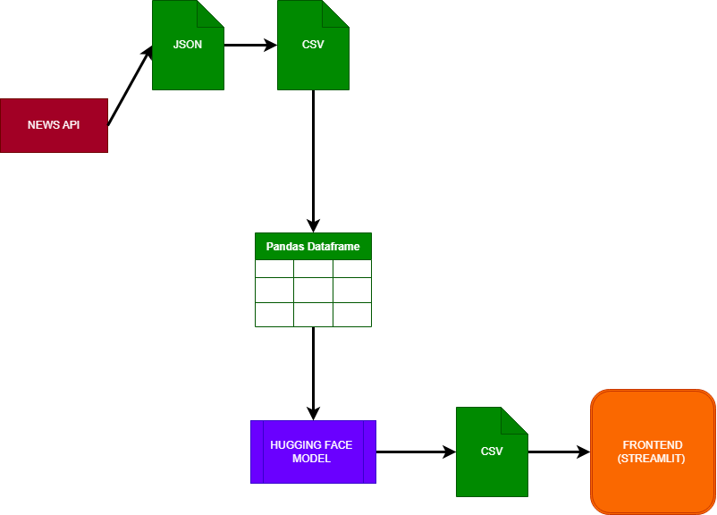

# NewsHarbor

- [Overview](#overview)
- [Tech Used](#tech-used)
- [Usage](#usage)
    - [How it works](#how-it-works)
- [Contributing](#contributing)
- [license](#license)

## Overview
News Harbor is a news pplatform that is detects the sentiment of News articles. [check out this demo](.\assets\demo.mp4)

This is how the project workflow is: 

## Usage
### How it works
- The user enters the news_article API_key; in this case i used my api key in the `.env` file in secrets folder which was loaded to the `news_api_data.py` file.

- The API is then used to fetch the news article from the news api, which returns a JSON. chcek the `news_api_data.py` file and the `news_api_data.json` file in core folder and data folder respectively.

- The JSON is then converted to a pandas dataframe and then the dataframe is sent to the sentiment analysis model. check the `convert.py` file in core folder. 

- The sentiment analysis model returns the sentiment of the news article in a CSV file format. check the `model.ipynb` file in model folder. Note: Google Colab was used in running the sentiment analysis model.

- The sentiment in CSV is sent to the frontend.

- The frontend displays the sentiment of the news article. check the `main.py` file in the frontend folder. 

## Tech Used 
- API: [News API](https://newsapi.org/) was used for the news feed Getting the news data for the model

- Hugging Face sentiment analysis model: [Hugging Face](https://huggingface.co/) was used for the sentiment analysis model

- Streamlit was used for the frontend of the project. [Streamlit](https://streamlit.io/)

## Contributing
Knowing fully well that the project is not at its best state 😢. News Harbor is open to contribution from differents parts of the project.

## License
NewsHarbor is licensed under the [MIT License](LICENSE). Feel free to use, modify, and distribute the application according to the terms of this license.
